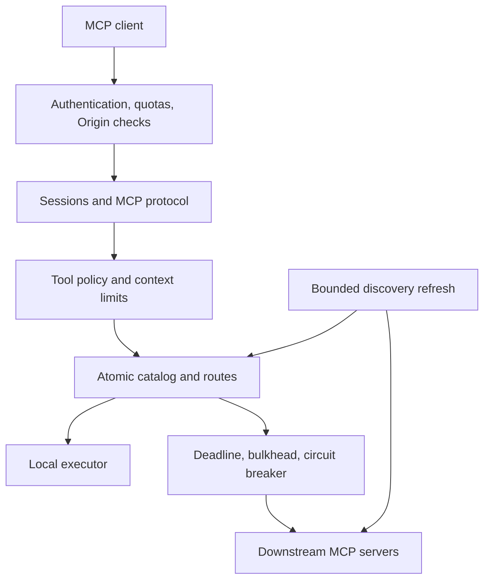

# MCP Context Gateway

A Go gateway that exposes local tools and tools from multiple downstream MCP HTTP servers through one endpoint. Discovery and execution share an atomic catalog, so advertised remote tools always have a route.

**Status:** functional tools gateway with unit, race, end-to-end, and official Python MCP SDK interoperability checks. Production deployment requires configuring credentials, TLS termination, and operational limits for your environment.

## What works

- MCP **2025-06-18** tools protocol, initialization, session lifecycle, ping, and cancellation.
- Downstream HTTP initialization, capability checks, session headers, JSON/SSE responses, bounded pagination, and response ID validation.
- Lossless remote tool results by default: `isError`, structured content, images/resources, and extension metadata survive the gateway.
- Server-prefixed tools (`github.search`, `jira.search`) with original downstream names retained for execution.
- Validated, cached discovery snapshots; bounded parallel refresh; per-server failure isolation.
- JSON Schema argument validation with external schema references disabled.
- Bearer service credentials, principal-specific tool/server rules, deny rules, Origin validation, quotas, and bounded concurrent requests.
- Per-downstream deadlines, bulkheads, circuit breakers, and safe session recovery for discovery. Tool calls are never automatically replayed.
- Optional per-request context redaction and output budgets, with explicit truncation notices.
- JSON logs, request IDs, tool audit records, Prometheus metrics, liveness/readiness, and graceful shutdown.

## Quick start

Go **1.24 or newer** is required. Use a currently supported, patched Go release for deployments.

```bash
go run ./cmd/gateway
curl http://127.0.0.1:8080/healthz
go test ./...
```

The default configuration listens only on `127.0.0.1:8080`, exposes `health.check`, and does not require credentials. Non-loopback binding requires configured principals. Origins are denied unless explicitly allowlisted.

The MCP endpoint is `http://127.0.0.1:8080/mcp`. Use a Streamable HTTP MCP client. Initialization returns an `MCP-Session-Id`; send it on subsequent requests, followed by `notifications/initialized`. The negotiated protocol is `2025-06-18` even when a client requests a newer version. `GET /mcp` returns 405 because this gateway does not expose a server-initiated event stream.

## Run the complete two-server example

Install the independent SDK fixtures once:

```bash
python3 -m venv .venv
.venv/bin/pip install -r tests/interop/requirements.txt
```

Start each command in its own terminal:

```bash
.venv/bin/python tests/interop/check.py --server 9001 --json
.venv/bin/python tests/interop/check.py --server 9002
go run ./cmd/gateway -config examples/two-servers.json
```

The gateway discovers `json.add`, `json.fail`, `sse.add`, and `sse.fail`, plus `health.check`. `add` takes integer arguments `a` and `b`; `fail` deliberately returns a tool error.

Or run the fully automated compatibility check. It starts both fixture servers and the gateway on temporary ports, exercises them with the official SDK client, and cleans up:

```bash
go build -o gateway ./cmd/gateway
.venv/bin/python tests/interop/check.py --binary ./gateway
```

Stop either fixture server and wait for the refresh interval. Its tools disappear; healthy tools remain usable. `/healthz` stays 200 while `/readyz` returns 503 until every configured server is healthy again.

## Configuration and access control

Configuration is strict JSON: unknown fields, duplicate names, invalid limits, and missing credential environment variables fail startup. Check without contacting downstream servers:

```bash
go run ./cmd/gateway -config examples/two-servers.json -check
```

See [configuration reference](docs/configuration.md) and [authenticated example](examples/authenticated.json).

```bash
export GATEWAY_READER_TOKEN="$(openssl rand -hex 32)"
go run ./cmd/gateway -config examples/authenticated.json
```

Configure the client to send `Authorization: Bearer <token>`. Credentials are read from environment variables, never literal config values. Upstream client credentials are not forwarded to downstream servers; each downstream may reference its own `tokenEnv`.

The same policy filters `tools/list` and checks `tools/call`. A caller cannot invoke a tool hidden by its policy. Denied calls return an unknown-tool error. Sessions are bound to the authenticated principal.

## Context policies

Context transforms are disabled by default. `context.redactKeys` masks exact, case-insensitive JSON keys in structured output and JSON-encoded text. It does **not** detect arbitrary secrets embedded in prose or images.

`context.maxOutputBytes` bounds the serialized tool result. Oversized output becomes a clearly marked text excerpt; structured/binary content is omitted, and the original `isError` is preserved. `context.maxEstimatedTokens` optionally applies a **bytes/4 heuristic**, not a model-specific tokenizer or a guaranteed token count. If both budgets are set, the tighter limit wins.

No tool content is retained between requests. No LLM summarization or external context service is used. These transforms can change downstream output schemas; clients opting into them must inspect `_meta.gateway.truncated` before using structured output.

## Architecture



| Package | Responsibility |
|---|---|
| `internal/app` | Configuration-driven composition and lifecycle |
| `internal/gateway` | Client-facing protocol and sessions |
| `internal/mcp` | Protocol types and downstream HTTP client |
| `internal/router` | Atomic catalog, ownership, discovery, routing |
| `internal/tools` | Local definitions and execution |
| `internal/validation` | JSON Schema compilation without external references |
| `internal/policy` | Authentication, tool/server access, quotas |
| `internal/context` | Optional redaction and context budgets |
| `internal/resilience` | Downstream concurrency and failure isolation |
| `internal/observability` | Structured logs and metrics |

## Verification

```bash
make check
# or
go vet ./...
go build ./...
go test -race -coverprofile=coverage.out ./...
```

CI runs these checks plus the official Python SDK interoperability scenario. Tests cover the reported regressions: broken fixtures, lost tool errors, discovery without routes, pagination, JSON/SSE transport, validation, cancellation, partial outage, policy enforcement, circuit recovery, and concurrent registry operations.

See [testing and operations](docs/operations.md) for deployment, readiness, failure exercises, and measurement guidance.

## Deliberate boundaries

- Tools-only gateway. Resources, prompts, sampling, elicitation, and task extensions are not advertised.
- Client-facing responses use JSON. Downstream SSE responses are consumed, but interrupted streams are not resumed and tool calls are not replayed.
- Downstream tools are refreshed on an interval or `SIGHUP`; this does not hot-reload configuration or credentials. Restart to change configured servers or credentials.
- Sessions, quotas, metrics, and catalogs are in memory. Use a single replica or session affinity; restart loses sessions. Distributed quotas and durable audit storage need external infrastructure.
- Downstream connections use a configured **service identity shared by authorized callers**. Do not use a stateful downstream that stores user-private session data across calls. Separate instances/service credentials are required for that isolation model.
- Static bearer authentication is intended for service clients or a trusted reverse proxy. OAuth authorization/discovery is not implemented. Terminate TLS before exposing this HTTP listener remotely.
- No external LLM summarization, semantic context routing, or production throughput claims. Context compression is explicit bounded excerpting.
- Docker/Kubernetes files are deployment templates. Validate images, TLS, secret management, and resource sizing in your infrastructure.
